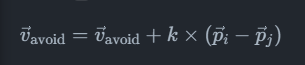
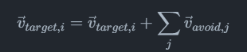
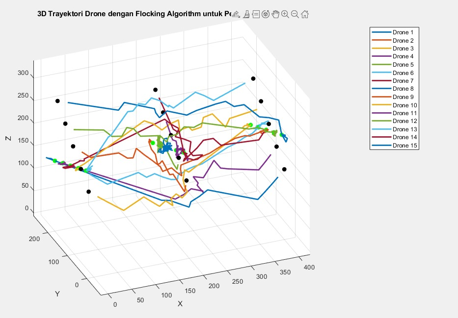
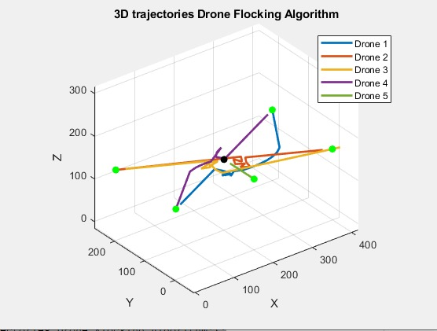
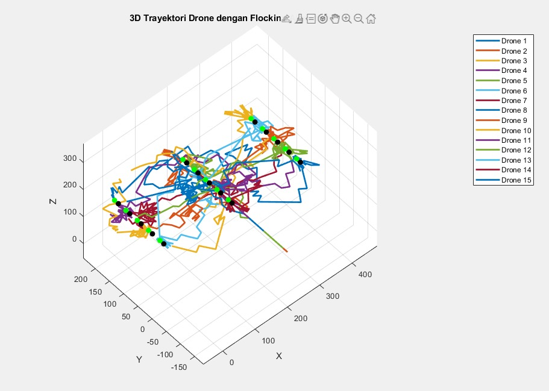

# Adaptive Drones & Flocking Algorithm (MATLAB)

## Persamaan Vektor Kecepatan dengan Pertimbangan Z
Ketika menghitung vektor kecepatan target `vTarget` dan vektor penghindaran `vAvoid`,  harus mempertimbangkan posisi Z sehingga drone dapat naik atau turun untuk menghindari tabrakan. Vektor posisi drone `i` diberikan oleh $p_{i}$

$$ \vec{p_i} = (x_i, y_i, z_i) $$ 

dan kecepatan drone `i` diberikan oleh $v_i$

$$ \vec{v_i} = (v_{x,i}, v_{y,i}, v_{z,i}) $$ 

## Penghindaran Tabrakan dengan Pertimbangan Z
Untuk setiap drone `i`, perhitungan vektor ke arah setiap drone `j` lainnya. Jika jarak $d_{ij}$ antara `i` dan `j` kurang dari jarak penghindaran minimum $d_{min}$, termasuk `Z`, drone `i` akan menyesuaikan vektornya untuk menghindari drone `j`.
Jarak antara 2 drone `i` dan `j` dihitung sebagai berikut:

$$ d_{ij} = \sqrt{(x_i-x_j)^2+(y_i-y_j)^2+(z_i-z_j)^2} $$

jika $d_{ij} < d_{min}$ maka vektor penghidaran $\vec{v}_{avoid}$ untuk drone `i` terhadap drone `j` dihitung dengan menambahkan `Z` dalam perhitungan



dimana k adalah faktor koreksi yang menyesuaikan seberapa jauh drone harus bergerak untuk menghindari drone lain, dan $(\vec{p}_{i}-\vec{p}_{j})$ adalah vektor dari drone `j` ke drone `i`

## Penyesuaian Vektor Kecepatan
Setelah menghitung semua vektor penghindaran terhadap drone lain, kita menyesuaikan vector kecepatan target $\vec{v}_{target,i}$ untuk drone `i` dengan menambagkan semua vector penghindaran:



Kemudian, membatasi kecepatan untuk memastikan drone tidak melebihi kecepatan maksimum $v_{max}$


Hal ini akan memastikan bahswa selain menghindari tabrakan, drone juga bisa naik atau turun untuk menghindari tabrakan.

## Implementasi Model Drone
Penggunaan $d_{min} (d_{sep})$ digunakan untuk menentukan jarak minimal penghindaran tabrakan dalam simulasi drone, dengan mempertimbangkan fisik drone (panjang, lebar, tinggi), untuk memberikan `buffer` yang realistis dan aman antar drone. Misalnya dalam penggunaan `DJI Tello` dapat dipertimbangkan fisiknya melalui model dan dimensinya fisiknya:
- Panjang: 98mm
- Lebar: 92.5mm
- Tinggi: 41mm

### Menentukan $d_{min}$
Untuk menentukan $d_{min}$ kita bisa mengambil dimensi terbesar dari drone dan menambahkan `buffer` untuk keamanan. hal ini bisa berupa jarak tambahan untuk memperhitungkan potensi error pengukuran, pergerakan tak terduga atau faktor eksternal lain.
Misalkan penambahan buffer sepanjang 60% dari dimensi terbesar drone, Jika kita menggunakan `DJI Tello` dengan panjang maksimum `98mm`, ini berarti:

$$ d_{buffer} = 98mm \times 0.60 = 58.8mm$$

Jadi total $d_{min}$ akan menjadi panjang drone ditambah buffer:

$$ d_{min} = 98mm + 58.8mm = 156.8mm $$

Namun, jika kita menggunakan skala lebih besar dan unit berbeda kita perlu mengonversi ini ke meter:

$$ d_{min} = 0.1568meter $$

## Penghindaran Tabrakan
Pada Flocking Algorithm ini penggunaan logika penghindaran tabrakan memprioritaskan drone agar tidak mengalah atau menghindar ke atas atau ke bawah disebabkan oleh beberapa faktor:
### Ketinggian Drone
Drone yang beroperasi pada ketinggian tertentu dianggap lebih aman atau stabil memiliki prioritas lebih rendah untuk menghindar dibandingkan dengan drone yang berada di ketinggian yang lebih sulit untuk navigasi. Melalui komparasi data posisi dan kecepatan drone dapat membandingkan ketinggian drone dan memberikan prioritas pada drone.

### Kecepatan dan Arah
Drone yang bergerak lebih cepat atau dalam lintasan lurus ke tujuan mungkin lebih sulit untuk mengubah kecepatan atau arah dibandingkan dengan drone yang bergerak lebih lambat atau dalam pola penerbangan yang lebih fleksibel.
Flocking Algorithm dapat memeriksa kecepatan dan arah relatif antara drone dan memberikan prioritas kepada yang memiliki kecepatan lebih tinggi atau berada dalam lintasan lurus untuk menghindari perubahan yang signifikan.

### Komunikasi dan Komparasi Antar Data
Drone yang dapat berkomunikasi dan berkoordinasi dengan lebih baik dengan drone lain atau sistem kontrol mungkin lebih mampu mengambil tindakan penghindaran tanpa mengorbankan misinya.

## Potensi Pemanfaatan Sistem Prioritas
### Status Misi atau Penugasan
Drone yang menjalankan misi kritis atau sensitif waktu, seperti operasi penyelamatan atau pengiriman medis darurat, mungkin diberikan prioritas lebih tinggi. 

### Sumber Daya atau Kapasitas Baterai
Drone dengan sumber daya terbatas atau baterai yang hampir habis mungkin diberi prioritas untuk tidak menghindar agar bisa segera kembali atau menyelesaikan misi tanpa mengkonsumsi energi tambahan.

# Hasil Simulasi

### 15 Drone dengan penghindaran naik atau turun

### 5 Drone dengan penghindaran dengan cara mengatur kecepatan

### 15 Drone dengan penghindaran dengan cara mengatur kecepatan


# Update: Persamaan Differensial
## Persamaan Matematis
Model dinamika drone bisa dinyatakan dengan persamaan diferensial berikut:

### Persamaan Kecepatan
${d\vec{v}/dt} = \vec{a}$

dimana $\vec{v}$ adalah vector kecepatan drone dan $\vec{a}$ adalah vektor percepatan yang dihasilkan dari pengaruh target dan penghindaran tabrakan.

### Persamaan Posisi
${d\vec{p}/dt} = \vec{v}$

dimana $\vec{p}$ adalah vector posisi drone

Persamaan diferensial ini menunjukkan bahwa perubahan posisi $(d\vec{p}/dt)$ drone sebanding dengan kecepatannya $(\vec{v})$, dan perubahan kecepatan $(d\vec{v}/dt)$ sebanding dengan percepatannya $(\vec{a})$

## Implementasi pada simulasi

Percepatan $\vec{a}$ dihitung berdasarkan dua faktor: kecepatan menuju target dan kecepatan untuk menghindari tabrakan. Ini dilakukan melalui penggabungan vektor kecepatan menuju target `vTarget` dengan vektor penghindaran `vAvoid`, yang kemudian diatur kecepatannya agar tidak melebihi `vMax`.

Integrasi Numerik (Metode Euler): Kita menggunakan metode Euler untuk mengintegrasikan persamaan diferensial secara numerik dengan langkah waktu $dt$. Ini berarti posisi dan kecepatan di-update pada setiap iterasi berdasarkan:

$\vec{v}_{baru} = \vec{v} + \vec{a} . dt$

$\vec{p}_{baru} = \vec{p} + \vec{a} . dt$

Dari kode, persamaan diferensial eksplisit untuk pergerakan drone dapat dituliskan sebagai

$\vec{a} = \alpha . (\vec{Vtarget} + {\vec{Vavoid}} - \vec{v})$

Di mana $\alpha$ adalah faktor kelembaman yang menyesuaikan seberapa cepat drone merespons perubahan dalam vektor kecepatan target dan penghindaran.

Persamaan posisi tidak secara langsung muncul dalam bentuk diferensial dalam kode tetapi dihitung menggunakan metode Euler dengan asumsi pergerakan linear selama $dt$:

$\vec{p_j} = \vec{p} + (\vec{v} + \alpha . (\vec{Vtarget} + \vec{Vavoid} - \vec{v})) . dt$

pergerakan drone diatur oleh kecepatan linear dan percepatan yang dihasilkan dari kombinasi antara kecepatan menuju target dan upaya menghindari tabrakan. Ini menciptakan sistem dinamis yang kompleks ketika banyak drone berinteraksi dan berusaha mencapai target mereka sambil menghindari tabrakan dengan drone lain.


# Update: Prediksi, Plotting Kecepatan dan Revisi nilai Alpha
## Perhitungan nilai alpha
Untuk mendapatkan nilai $\alpha$ yang merupakan faktor kelembaman dengan mempertimbangkan massa dan gravitasi, serta untuk mendapatkan nilai prediksi penghindaran drone, kita menggunakan beberapa persamaan matematis.

$a = k(g/m)$

dimana $k$ adalah konstanta responsivitas drone, $g$ adalah gravitasi bumi $(9.8m/s^2)$ dan $m$ adalah massa drone $1kg$

Tujuan dari $\alpha$ adalah untuk mengatur seberapa cepat drone menyesuaikan kecepatannya menuju target atau menghindari halangan, dengan memperhitungkan efek gravitasi dan massa drone itu sendiri.

## Persamaan untuk Prediksi Penghindaran Drone
Prediksi penghindaran drone, terutama untuk menentukan waktu dan titik tabrakan potensial antara dua drone, dapat dihitung menggunakan vektor posisi relatif dan vektor kecepatan relatif. Kita asumsikan dua drone memiliki posisi $\vec{p_1}$ dan $\vec{p_2}$ serta kecepatan $\vec{v_1}$ dan $\vec{v_2}$ Waktu $t$ untuk tabrakan potensial dapat dihitung sebagai:

$t = -(\vec{p_2} - \vec{p_1}) . (\vec{v_2} - \vec{v_1}) / ||\vec{v_2} - \vec{v_1}||^2$

Titik tabrakan potensial $\vec{p}$ pada waktu $t$ dapat dihitung dengan:

$\vec{p} = \vec{p_1} + \vec{v_1}. t $

Jika $t$ bernilai positif dan kurang dari interval waktu simulasi, maka terdapat potensi tabrakan, dan titik $\vec{p}$ menunjukkan lokasi tabrakan tersebut.

## berapa target waktu awal drone berangkat sampai tiba di target, dan setelah diaplikasikan algoritma yang digunakan berapa waktunya ? apakah ada perbedaan ?
Untuk menentukan target waktu awal drone berangkat sampai tiba di target, serta membandingkannya dengan waktu setelah algoritma yang digunakan diterapkan, kita perlu memahami beberapa aspek:

Target waktu awal dapat dihitung berdasarkan jarak awal ke target dan kecepatan maksimum drone, asumsikan pergerakan linear tanpa hambatan. Jika jarak total dari posisi awal ke target adalah $d$ dan kecepatan maksimum drone adalah $v_{max}$, waktu awal $(t_{awal})$ yang dibutuhkan dapat dihitung dengan:

$t_{awal} = d / v_{max}$

Untuk menentukan ini, kita perlu melacak waktu simulasi yang dibutuhkan dari awal hingga semua drone mencapai target mereka, dengan memperhitungkan penghindaran tabrakan dan perubahan rute. Waktu ini secara langsung tercatat melalui iterasi simulasi, dimana setiap iterasi mewakili step waktu $(dt)$.

Perbedaan waktu antara $t_{awal}$ dan waktu setelah aplikasi algoritma mengindikasikan pengaruh dari penghindaran tabrakan dan navigasi pada efisiensi waktu perjalanan.

Untuk menganalisis secara eksplisit menggunakan kode, kita perlu pertama-tama menghitung $t_{awal}$ untuk setiap drone berdasarkan posisi awal dan targetnya, kemudian membandingkannya dengan waktu yang dihasilkan dari simulasi setelah menerapkan algoritma penghindaran tabrakan.

Sebagai contoh, jika kita memiliki data simulasi yang lengkap, hal yang perlu dilakukan yakni melakukan perhitungan sederhana untuk target waktu awal seperti di atas, lalu membandingkannya dengan $iterasi×dt$ untuk mendapatkan waktu akhir setelah aplikasi algoritma. Kita asumsikan $dt=0.05$ detik per iterasi dan iterasi total adalah jumlah loop yang dijalankan sampai semua drone mencapai target.

```
% Contoh penghitungan waktu awal (sederhana dan teoretis)
d = norm(posisi_awal(1, :) - target_posisi(1, :)); % Jarak untuk drone 1
v_max = 20; % Kecepatan maksimum
t_awal = d / v_max;

% Waktu setelah aplikasi algoritma
iterasi_total = iterasi; % Nilai iterasi ketika semua drone mencapai target
dt = 0.05; % Delta waktu per iterasi
t_akhir = iterasi_total * dt;

% Perbedaan
perbedaan_waktu = t_akhir - t_awal;

```